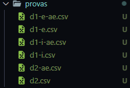

# Corretor de Simulados Einstein Floripa (SimuENEM, SimUFSC e Simulinho)

### Introdução

O algortimo aqui desenvolvido serve para corrigir os simulados do EF (Enstein Floripa), ele recebe como input o **gabarito**, as **provas (com uma estrutura de nomes)** e uma lista com os **dados dos alunos**, tudo isso sendo arquivos ***.csv***

### Estrutura de pastas (input)

É muito importante que os arquivos/pastas sigam essa estrutura na pasta **/inputs**, seguindo os nomes.

A seguir a estrutura de cada arquivo nas pastas.

- Alunos

- Gabarito

- Provas

d1 = dia 1,
d2 = dia 2

e = Espanhol,
i = Inglês,
ae = Aplicação Especial

### Estrutura dos CSV (Provas e Gabarito)

Os arquivos ***.csv*** devem seguir uma estrutura, para isso bastar acessar a pasta **/templates** e lá terá o modelo a ser seguido. É muito importante que sigam a mesma estrutura de colunas!

### Como executar a correção?

Após de ter sido organizado a estrutura de pastas, basta você excutar o código

`pipenv run gerar` *[como instalar pipenv](https://pipenv.pypa.io/en/latest/)*

ou 

`python3 ./src/index.py`

teste_supimpa